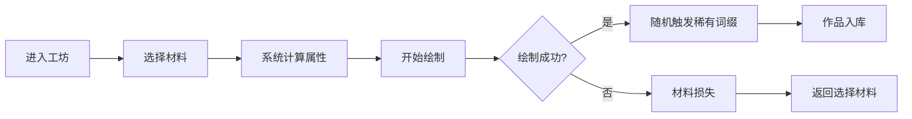
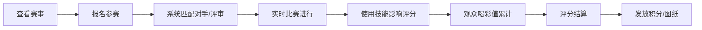
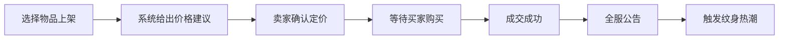

## 1. 产品概述

魔法世界纹身系统是一款多人在线模拟经营与竞技游戏，玩家通过创建纹身工坊、收集魔法材料、参与纹身大赛和交易来构建自己的纹身帝国。系统融合了策略经营、实时竞技、社交互动和数据可视化元素，为玩家提供沉浸式的魔法纹身创作体验。

## 2. 核心功能

### 2.1 用户角色
| 角色 | 注册方式 | 核心权限 |
|------|----------|----------|
| 玩家 | 系统自动创建 | 创建工坊、绘制纹身、参与大赛、交易、加入公会 |
| 公会会长 | 玩家升级创建 | 管理公会、建造联合工坊、发起升级 |

### 2.2 功能模块
1. **首页/仪表盘**：玩家概览、今日赛事、快捷入口
2. **纹身工坊**：材料管理、纹身绘制、作品展示
3. **纹身大赛**：实时比赛、观众互动、技能使用、排行榜
4. **交易市场**：买卖颜料/针/图纸、价格建议、成交公告
5. **公会系统**：联合工坊、颜料实验室、贡献系统
6. **产业报告**：数据统计、热力图、评分曲线、PDF导出
7. **排行榜**：收藏度、大赛积分、公会贡献排名

### 2.3 页面详情
| 页面名称 | 模块名称 | 功能描述 |
|-----------|-------------|---------------------|
| 首页 | 玩家状态面板 | 显示金币、材料数量、工坊等级、今日暴击率 |
| 首页 | 今日赛事 | 展示正在进行的大赛，快速参赛入口 |
| 首页 | 快捷操作 | 快速进入绘制、交易、公会等模块 |
| 纹身工坊 | 材料仓库 | 展示颜料、针、图纸库存，支持筛选 |
| 纹身工坊 | 纹身绘制台 | 选择材料、预览设计、开始绘制流程 |
| 纹身工坊 | 作品展示墙 | 玩家已完成的纹身作品，显示属性和词缀 |
| 纹身大赛 | 赛事大厅 | 查看今日赛事列表、报名状态、奖励预览 |
| 纹身大赛 | 实时比赛 | 实时评分、观众喝彩、技能使用、对手状态 |
| 纹身大赛 | 比赛结果 | 最终评分、奖励发放、排名展示 |
| 交易市场 | 商品列表 | 展示在售材料、价格、卖家信息 |
| 交易市场 | 我的摊位 | 上架物品、定价、查看成交记录 |
| 交易市场 | 成交公告 | 全服成交滚动公告、纹身热潮提示 |
| 公会系统 | 公会主页 | 公会信息、成员列表、贡献榜 |
| 公会系统 | 联合工坊 | 工坊等级、成员加成、升级进度 |
| 公会系统 | 颜料实验室 | 实验配方、材料合成、属性增强 |
| 产业报告 | 数据概览 | 本周关键指标摘要 |
| 产业报告 | 可视化图表 | 颜料使用率热力图、大赛评分曲线、价格走势 |
| 产业报告 | 报告导出 | 生成含雷达图和趋势图的PDF报告 |
| 排行榜 | 个人排行 | 纹身收藏度、大赛积分排名 |
| 排行榜 | 公会排行 | 公会贡献、联合工坊等级排名 |
| 排行榜 | 玩家详情 | 查看他人工坊布局、纹身记录 |

## 3. 核心流程

### 3.1 纹身绘制流程
玩家进入工坊 → 选择颜料/针/图纸 → 系统计算属性和成功率 → 开始绘制（显示进度）→ 绘制完成 → 随机触发稀有词缀 → 入库展示

### 3.2 纹身大赛流程
查看赛事 → 报名参赛 → 系统匹配对手/评审 → 实时比赛（绘制+技能）→ 评分结算 → 发放奖励

### 3.3 交易流程
选择物品上架 → 设置价格（系统建议区间）→ 等待买家 → 成交 → 全服公告 → 触发纹身热潮事件

## 4. 用户界面设计

### 4.1 设计风格
- **主色调**：深紫 (#6B21A8) 魔幻基调，配合金色 (#D4AF37) 魔法辉光，血色暗红 (#9B1C1C) 点缀
- **辅助色**：魔法蓝 (#3B82F6)、翠绿 (#10B981)、幻彩渐变
- **按钮风格**：圆角魔法符文边框，悬停发光效果，按下凹陷动画
- **字体**：Cinzel Decorative（标题魔幻字体）+ Crimson Pro（正文学术字体）
- **布局风格**：卡牌式布局，羊皮纸质感背景，魔法阵装饰元素
- **图标/emoji风格**：Lucide图标配合魔法符文emoji ✨🔮🧙‍♂️🎨⚔️

### 4.2 页面设计概述
| 页面名称 | 模块名称 | UI元素 |
|-----------|-------------|-------------|
| 首页 | 玩家状态面板 | 金色边框卡牌、渐变背景、数据跳动动画 |
| 首页 | 今日赛事 | 魔法卷轴样式卡片、倒计时动画、脉冲报名按钮 |
| 纹身工坊 | 材料仓库 | 网格布局材料卡片、悬浮放大效果、品质光晕 |
| 纹身工坊 | 纹身绘制台 | 中央圆形魔法阵画布、进度环动画、粒子爆发效果 |
| 纹身工坊 | 作品展示墙 | 瀑布流布局、卡片翻转查看详情、稀有词缀发光 |
| 纹身大赛 | 实时比赛 | 双栏对战布局、实时数据折线图、技能冷却CD、喝彩值进度条 |
| 交易市场 | 商品列表 | 行情K线样式价格展示、建议区间高亮、价格趋势箭头 |
| 公会系统 | 联合工坊 | 3D立体建筑升级进度、成员贡献环形图、集体加成效果展示 |
| 产业报告 | 可视化图表 | 雷达图、热力图、评分曲线图、渐变填充区域 |
| 排行榜 | 排行列表 | 冠亚季军特殊奖杯图标、排名变化动画、金色/银色/铜色光晕 |

### 4.3 响应式设计
- 采用桌面端优先设计（1440px基准）
- 平板端（768px-1024px）：侧边栏折叠为汉堡菜单，卡片两列布局
- 移动端（<768px）：单列布局，底部Tab导航，压缩非核心信息

### 4.4 视觉特效
- 魔法粒子浮动背景
- 纹身绘制时的电流/光晕粒子动画
- 稀有词缀触发时的全屏闪光+烟花粒子
- 大赛高潮时的观众欢呼波纹效果
- 页面切换时的魔法烟雾过渡
- 悬停卡片时的微浮动+发光阴影
