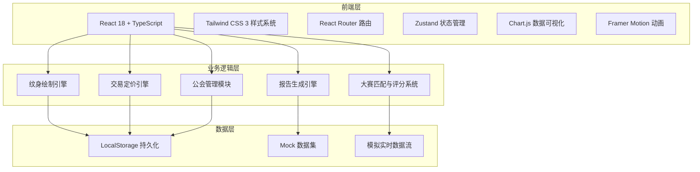
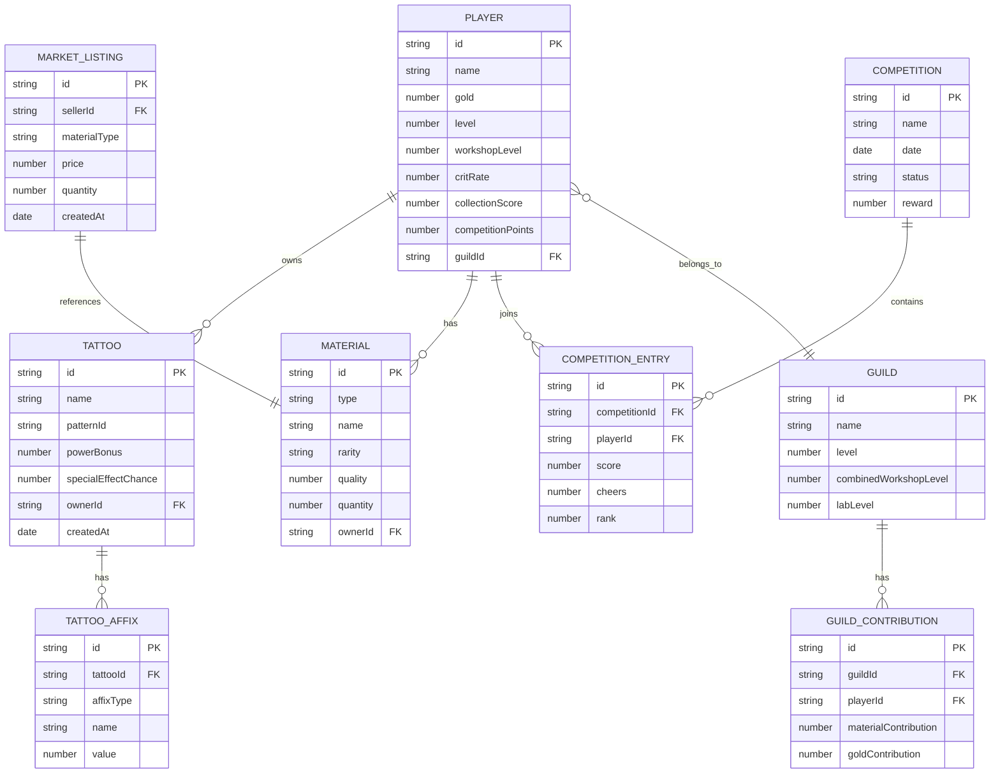

## 1. 架构设计



## 2. 技术描述

- **前端框架**: React@18 + TypeScript
- **构建工具**: Vite@5
- **样式方案**: Tailwind CSS@3 + 自定义CSS变量主题
- **路由管理**: React Router DOM@6
- **状态管理**: Zustand@4
- **数据可视化**: Chart.js@4 + react-chartjs-2
- **动画库**: Framer Motion@11
- **图标库**: Lucide React
- **后端**: 无后端，纯前端实现，使用LocalStorage持久化 + Mock数据
- **数据持久化**: LocalStorage

## 3. 路由定义

| 路由 | 页面组件 | 功能描述 |
|-------|---------|---------|
| / | Dashboard | 首页仪表盘 |
| /workshop | Workshop | 纹身工坊 |
| /workshop/create | TattooCreate | 纹身绘制台 |
| /competition | Competition | 纹身大赛大厅 |
| /competition/active | CompetitionLive | 实时比赛界面 |
| /market | Market | 交易市场 |
| /guild | Guild | 公会系统 |
| /reports | Reports | 产业报告 |
| /leaderboard | Leaderboard | 全服排行榜 |
| /player/:id | PlayerProfile | 玩家详情页 |

## 4. 数据模型

### 4.1 数据模型ER图



### 4.2 核心数据接口定义

```typescript
// 玩家
interface Player {
  id: string;
  name: string;
  gold: number;
  level: number;
  workshopLevel: number;
  critRate: number;
  collectionScore: number;
  competitionPoints: number;
  guildId: string | null;
}

// 材料类型
type MaterialType = 'pigment' | 'needle' | 'pattern';
type Rarity = 'common' | 'uncommon' | 'rare' | 'epic' | 'legendary';

interface Material {
  id: string;
  type: MaterialType;
  name: string;
  rarity: Rarity;
  quality: number;
  quantity: number;
  icon: string;
  description: string;
}

// 纹身
type AffixType = 'frenzy' | 'guardian' | 'dazzle' | 'swift' | 'vampire' | 'thunder';

interface Tattoo {
  id: string;
  name: string;
  patternName: string;
  pigmentId: string;
  needleId: string;
  patternId: string;
  powerBonus: number;
  specialEffectChance: number;
  affixes: TattooAffix[];
  createdAt: number;
  imageSeed: number;
}

interface TattooAffix {
  type: AffixType;
  name: string;
  value: number;
  description: string;
}

// 大赛
interface Competition {
  id: string;
  name: string;
  status: 'upcoming' | 'active' | 'finished';
  startTime: number;
  endTime: number;
  participants: number;
  reward: { points: number; patternId: string | null };
}

interface LiveCompetitionState {
  competitionId: string;
  playerScore: number;
  opponentScore: number;
  playerCheers: number;
  opponentCheers: number;
  timeRemaining: number;
  skills: SkillState[];
  status: 'preparing' | 'drawing' | 'finished';
}

interface SkillState {
  id: string;
  name: string;
  description: string;
  cooldown: number;
  currentCooldown: number;
  effect: number;
}

// 交易
interface MarketListing {
  id: string;
  sellerId: string;
  sellerName: string;
  material: Material;
  price: number;
  suggestedMin: number;
  suggestedMax: number;
  createdAt: number;
}

// 公会
interface Guild {
  id: string;
  name: string;
  level: number;
  combinedWorkshopLevel: number;
  labLevel: number;
  members: GuildMember[];
  upgradeProgress: { materials: number; gold: number };
  upgradeRequirements: { materials: number; gold: number };
}

interface GuildMember {
  playerId: string;
  playerName: string;
  materialContribution: number;
  goldContribution: number;
}

// 报告数据
interface IndustryReport {
  period: string;
  pigmentUsage: Record<string, number>;
  competitionScores: number[];
  priceTrends: { material: string; prices: number[] }[];
  topTattoos: Tattoo[];
  radarData: {
    power: number;
    rarity: number;
    technique: number;
    creativity: number;
    popularity: number;
  };
}

// 排行榜
interface LeaderboardEntry {
  playerId: string;
  playerName: string;
  rank: number;
  previousRank: number;
  score: number;
  avatar: string;
}
```

## 5. 核心模块设计

### 5.1 纹身绘制引擎
- 输入：颜料品质、针法熟练度、图案稀有度
- 输出：魔力加成、特殊效果概率、稀有词缀
- 算法：加权评分 + 随机概率触发

### 5.2 大赛评分系统
- 实时评分更新（基于绘制进度 + 技能效果 + 观众喝彩）
- 自动匹配对手（基于ELO评分机制模拟）
- 评审团评分（多维度加权计算）

### 5.3 交易定价引擎
- 近7天成交均价计算
- 价格建议区间（±15%浮动）
- 纹身热潮触发（成交后全服暴击率提升）

### 5.4 状态管理架构
```
useGameStore (Zustand)
├── player: PlayerState
├── materials: MaterialState
├── tattoos: TattooState
├── competition: CompetitionState
├── market: MarketState
├── guild: GuildState
└── ui: UIState
```
